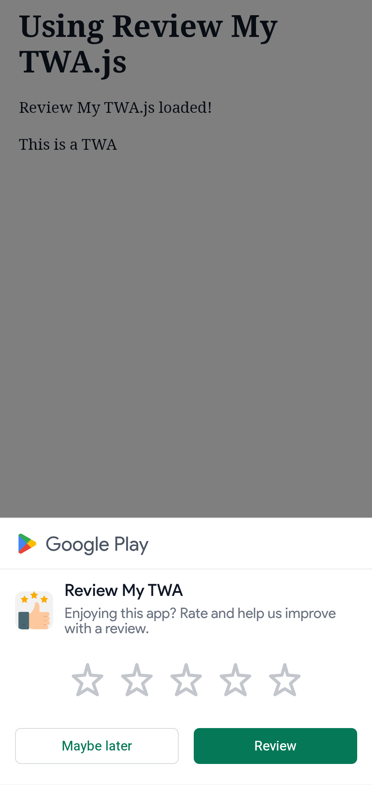
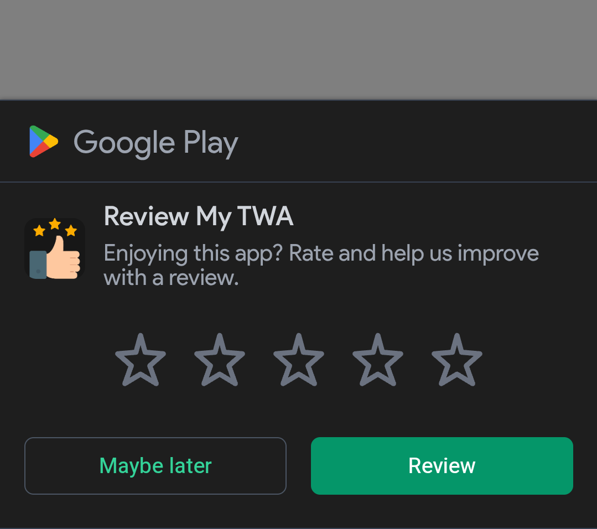
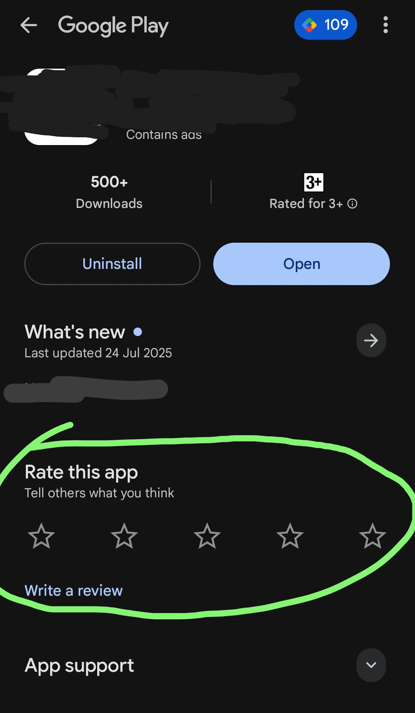
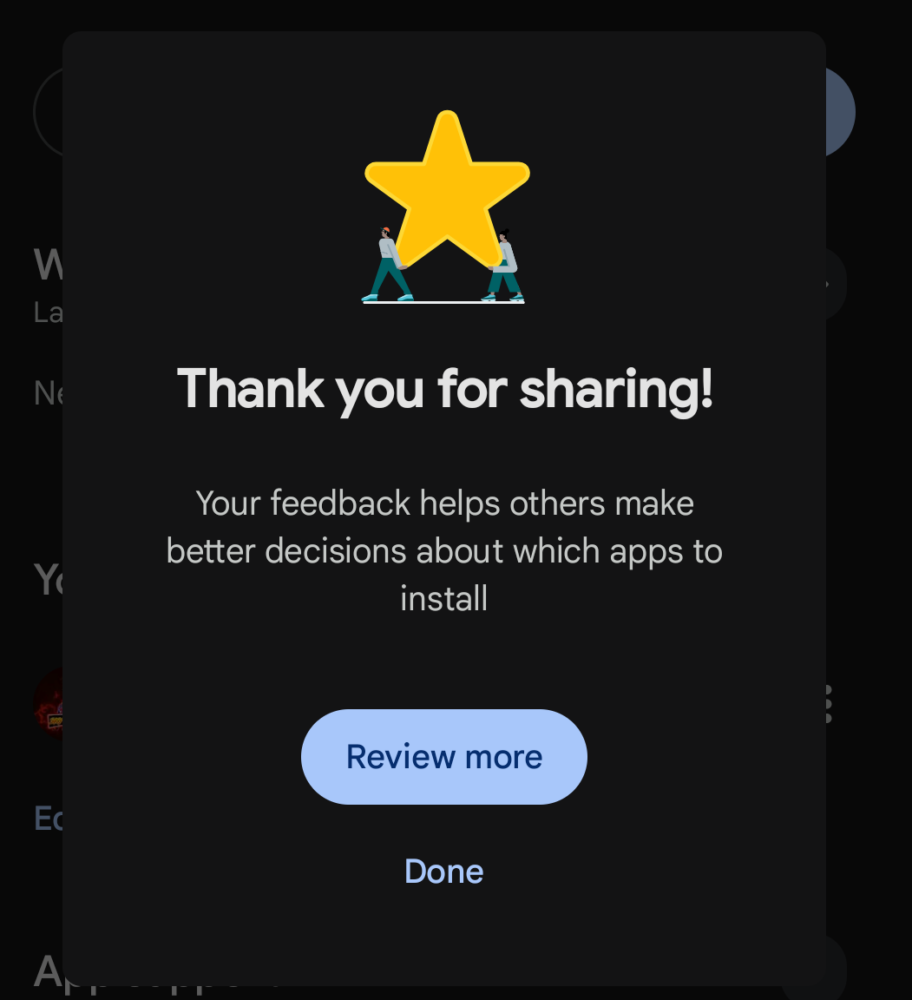

# Review My TWA.js

[](https://www.npmjs.com/package/review-my-twa)
[](https://www.jsdelivr.com/package/npm/review-my-twa)

A lightweight JavaScript library that helps Trusted Web Activities (TWA) collect more Play Store reviews by showing a non-intrusive in-app review dialog. Ideal for PWA developers publishing to the Play Store using TWA.




*Dark mode*


*On Review click or star button click on our in-app dialog, user redirected to the Play Store review section*


*Review done* 🥳

## 🧠 Features

* ✅ Detects if app is running as a TWA (`isTWA`)
* ✅ Shows a Play Store review prompt after a configurable number of days
* ✅ Automatically show the pop-up again after 7 days when user clicks **Maybe later** or outside pop-up.
* ✅ Simple, lightweight, and dependency-free
* ✅ Supports light, dark, and system themes
* ✅ Designed for real-world TWA deployment

## 📋 Prerequisites

Before using **Review My TWA**, make sure your web app meets the following requirements:

1. **Digital Asset Links**

   * Ensure you have a valid [Digital Asset Links](https://developer.android.com/training/app-links/verify-android-applinks) JSON file available at:

     ```
     /.well-known/assetlinks.json
     ```

2. **Web Manifest**

   * Your PWA should include a valid manifest file at either of the following paths:

     ```
     /manifest.json
     ```

     or

     ```
     /manifest.webmanifest
     ``` 

3. **Start URL Parameter**

   * In your **manifest file**, add a UTM parameter to the `start_url`:

     ```json
     "start_url": "/?utm_source=pwa",
     ```
   * This helps detect if the app is running as a regular PWA (browser install).

4. **TWA Packaging Start URL**

   * When packaging your app using [PWABuilder](https://www.pwabuilder.com/), [Bubblewrap](https://github.com/GoogleChromeLabs/bubblewrap), or a similar service for TWA (APK/AAB deployment), update the `start_url` to:

     ```json
     "start_url": "/?utm_source=twa",
     ```
   * This allows **Review My TWA** to detect that it’s running in a **Trusted Web Activity** (TWA) context.

## 📦 Installation

### Install via script tag

Include the script module via CDN:

```html
<script type="module">
  import reviewMyTwa from 'https://cdn.jsdelivr.net/npm/review-my-twa@1.1.0/+esm'
</script>
```

> This script automatically checks if the app is running as a Trusted Web Activity (`isTWA`) and shows review dialog automatically if TWA detected. You can further customize the dialog through [APIs mentioned below 👇](#-api-reference).

### 1. Install via NPM

```bash
npm install review-my-twa
```

### 2. Usage in Your JS/TS Project

Import and use it inside your JavaScript or TypeScript file:

```js
import ReviewMyTWA from 'review-my-twa';

window.addEventListener("reviewMyTwaReady", () => {
  if (ReviewMyTWA.isTWA) {
    console.log("This is a TWA");
  } else {
    console.log("This is not a TWA");
  }

  ReviewMyTWA.showAfter(7);
  ReviewMyTWA.setTheme("system");
});
```

> Make sure you're running this in a TWA environment — the dialog will **not show** otherwise.

### 3. Bundle Your Code

If you're using a bundler like **Vite**, **Webpack**, or **esbuild**, everything will work out of the box.

## 🚀 Customize

```html
<script>
window.addEventListener("reviewMyTwaReady", () => {
  // Example: Show review dialog 7 days after the user first opened your app
  ReviewMyTWA.showAfter(7);

  // Set theme mode (optional)
  // Options: "light", "dark", "system" (default is system if not specified)
  ReviewMyTWA.setTheme("system");
});
</script>
```

## 🧪 How to Test

After installing and integrating the script:

1. **Open your TWA app or download the [test apk here](https://github.com/realhirak/twa-review/tree/main).**
2. **Wait few seconds** to allow the script to fully load in the background.
3. **Close the app.**
4. **Change your device date** to 8 days in the future.
5. **Re-launch the app.** You should now see the **Review dialog** appear automatically.

### 🔧 Custom `showAfter` Scenario

If you’ve manually set a custom delay like:

```js
ReviewMyTWA.showAfter(20);
```

Then, to trigger the dialog:

* Set your device date **21 days into the future** before re-launching the app.

## 🛠 API Reference

### `reviewMyTwaReady Event Listener"

Detect if Review My TWA is available before executing customization codes.

```js
window.addEventListener("reviewMyTwaReady", () => {

if (ReviewMyTWA.isTWA) {
  alert("This is a TWA");
} else {
  alert("This is not a TWA");
}

ReviewMyTWA.showAfter(3);

});
```

### `ReviewMyTWA.showAfter(days: number)`

Shows the in-app review dialog after a certain number of days since the first opening of the app.

```js
ReviewMyTWA.showAfter(5); // Show after 5 days. If not mentioned, default to 7. min 1 and max 90
```

### `ReviewMyTWA.setTheme(mode: "light" | "dark" | "system")`

Sets the theme of the review dialog.

```js
ReviewMyTWA.setTheme("dark"); // Force dark mode
```

If not called, it defaults to `"system"`.

## 🕵️‍♂️ TWA Detection

The script checks whether your app is running as a Trusted Web Activity. If not, the review dialog will never appear. You can use this to show different content for Web users and TWA users.

```js
if (ReviewMyTWA.isTWA) {
  // alert("Running inside TWA");
}
```

## 📄 License

MIT © \[Hirak Kalita]

## 🙌 Contribute

Pull requests are welcome! If you find bugs or want to request features, feel free to [open an issue](https://github.com/realhirak/review-my-twa/issues).
